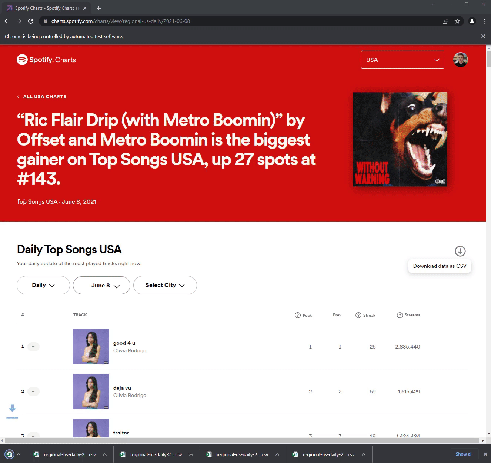

# Spotify Charts Data Ripper

This script downloads the Spotify daily top songs in the USA from Jan 1st 2017 to today. It uses [Selenium](https://www.selenium.dev/) and the [Spotify Charts](https://charts.spotify.com/) website. Each day's data is placed in your downloads folder in CSV format.

_You must have Google Chrome installed. However, you can modify the code to use any major browser you prefer._

The `data` folder contains an already started batch of data files.

# How to use

- Clone the repository
- Install dependencies using PIP
  - `pip install -U selenium`
  - `pip install webdriver-manager`
  - `pip install pandas`
  - `pip install python-dotenv`
- Create a `.env` file with the following variables:
  - `SPOTIFY_USERNAME` (Your Spotify username or email)
  - `SPOTIFY_PASSWORD` (Your Spotify password)
- Run `python main.py`

# Troubleshooting

Errors can happen if the script tries to click the download button before the page finishes loading. If you run into issues with it, either modify the starting date or increase the `time.sleep()` time.

# Visualization

You can use this data to make some pretty interesting visualizations. Here is an example of a bar race chart showing the most streamed tracks per day: https://public.flourish.studio/story/1429985/
